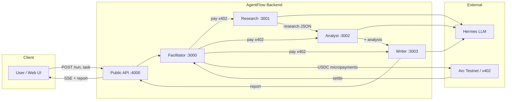

## AgentFlow — Autonomous AI agents on Arc Testnet

AgentFlow is a demo of an **AI agent economy** on **Arc Testnet**, fully powered by **Circle x402 Batching** and **Hermes AI**:

- **Orchestrator** (Hermes LLM) receives a user task and pays:
  - **Research agent** (research)
  - **Analyst agent** (analysis)
  - **Writer agent** (final report, markdown)
- All payments are **gasless USDC micropayments** via Circle x402 Batching on **Arc Testnet**.

The high-level flow is:

User → AgentFlow Orchestrator → pays 3 agents via x402 → returns report + receipt + web UI

### Architecture



### 1. Project structure

```text
agentflow/
├── .env
├── .env.example
├── .npmrc
├── package.json
├── tsconfig.json
├── lib/
│   ├── hermes.ts              # OpenAI-compatible Hermes helper
│   ├── live-data.ts           # Live crypto + DuckDuckGo data for research
│   └── orchestrator.ts        # Shared orchestrator logic + events
├── agents/
│   ├── research/
│   │   └── server.ts          # Research agent — x402 seller + Hermes
│   ├── analyst/
│   │   └── server.ts          # Analyst agent — x402 seller + Hermes
│   └── writer/
│       └── server.ts          # Writer agent — x402 seller + Hermes
├── orchestrator/
│   └── index.ts               # CLI entrypoint, calls lib/orchestrator
├── ui/
│   ├── server.ts              # Express server for AgentFlow Web UI (port 4000)
│   └── index.html             # Single-page web UI
├── web/                       # Next.js 14 + RainbowKit app (Vercel-ready)
│   ├── app/                   # App router pages and layout
│   ├── components/            # Header, Onboarding, AgentPipeline, etc.
│   └── lib/                   # Arc chain config, wagmi, hooks
└── scripts/
    ├── deposit.ts             # One-time: deposit USDC into Gateway
    └── check-balances.ts      # Check wallet + Gateway balances
```

### 2. Prerequisites

- Node.js **v20+**
- npm **v8+**
- **Arc Testnet** USDC test funds (via Circle faucet)
- **Cloudsmith** entitlement token (`CLOUDSMITH_TOKEN`) for `@circlefin/*`
- **Hermes** (Nous Research) LLM API key + base URL (OpenAI-compatible; default model: Hermes-4-405B)

### 3. Private registry setup (required)

`.npmrc` is already created at the repo root with:

```ini
@circlefin:registry=https://npm.cloudsmith.io/circle/common-private/
//npm.cloudsmith.io/circle/common-private/:_authToken=${CLOUDSMITH_TOKEN}
```

npm reads the token from the **environment** when it runs. So either export it in your shell, or use the setup script (recommended).

### 4. Install dependencies

Put `CLOUDSMITH_TOKEN=your_token` in your `.env` file (see step 5), then from the project root run one of:

**Option A — Node setup (cross-platform):**
```bash
npm run setup
```

**Option B — PowerShell (Windows):** set the token from `.env` in the current shell, then install:
```powershell
$env:CLOUDSMITH_TOKEN=(Get-Content .env | Select-String 'CLOUDSMITH_TOKEN' | ForEach-Object { ($_ -replace 'CLOUDSMITH_TOKEN=','').Trim() })
npm install
```

**Option C — PowerShell script (Windows):** run the script that loads `.env` and runs `npm install`:
```powershell
.\scripts\setup.ps1
```

If you prefer to set the token manually (no `.env`):

- **Bash:** `export CLOUDSMITH_TOKEN=your_token` then `npm install`
- **PowerShell:** `$env:CLOUDSMITH_TOKEN="your_token"; npm install`

If you see 404 or auth errors for `@circlefin/x402-batching`, double-check:

- `CLOUDSMITH_TOKEN` is in `.env` (and you used `npm run setup`) or exported in your shell
- `.npmrc` matches the snippet above

### 5. Environment configuration

Copy `.env.example` to `.env` and fill in values:

```bash
cp .env.example .env
```

Key variables (see `cursorrules` for full list):

- `PRIVATE_KEY` — EVM wallet private key (use the same wallet you connect in the web app)
- `CLOUDSMITH_TOKEN` — Cloudsmith registry token
- `HERMES_API_KEY`, `HERMES_BASE_URL`, `HERMES_MODEL`
- `RESEARCH_AGENT_URL`, `ANALYST_AGENT_URL`, `WRITER_AGENT_URL`
- `RESEARCH_AGENT_PRICE`, `ANALYST_AGENT_PRICE`, `WRITER_AGENT_PRICE`

### 6. Running the agents

Each agent is an Express server with an x402-protected `/run` endpoint.

**Option A — All in one terminal:**
```bash
npm run dev:stack         # Facilitator + all 3 agents (ports 3000–3003)
```

**Option B — Separate terminals:**
```bash
npm run dev:facilitator   # Facilitator on :3000
npm run dev:research      # agents/research/server.ts (default :3001)
npm run dev:analyst       # agents/analyst/server.ts (default :3002)
npm run dev:writer        # agents/writer/server.ts  (default :3003)
```

### 7. Deposit and check balances

Before running the orchestrator you should have some USDC in the Gateway.

```bash
npm run script:deposit          # One-time deposit of 1 USDC
npm run script:check-balances   # Wallet + Gateway balances
```

### 8. Run the AgentFlow orchestrator (CLI)

The orchestrator CLI is the x402 buyer. It pays all three agents and prints a
receipt plus the final report.

```bash
npm run dev:orchestrator -- "Research Ethereum's 2025 roadmap"
```

This will:

1. Call the **Research agent** (`/run?task=...`) via x402.
2. Pass research JSON to the **Analyst agent**.
3. Pass research + analysis JSON to the **Writer agent** (markdown report).
4. Call Hermes again to summarize the overall flow.
5. Print an ASCII **AGENT ECONOMY RECEIPT** (now backed by real tx IDs) and show:
   - Per-agent prices
   - Total USDC spent
   - Gas fees (`$0.000`, gasless)
   - Transaction IDs used in the web UI

### 9. Run the AgentFlow Web UI

AgentFlow also ships a single-page web UI, ideal for demos and hackathon stages.

1. Start the backend (facilitator + agents) and UI:

   ```bash
   npm run dev:stack        # Facilitator + 3 agents (ports 3000–3003)
   npm run dev:ui           # UI backend on :4000
   ```

2. Open the classic UI in your browser:

   ```text
   http://localhost:4000
   ```

In the UI you will see:

- A **prompt box** for “What should the agents research?”
- A **Run AgentFlow** button that triggers the full orchestrator flow
- A live **3-step pipeline**:
  - Step 1: Research Agent — paying `$0.005` USDC
  - Step 2: Analyst Agent — paying `$0.003` USDC
  - Step 3: Writer Agent — paying `$0.008` USDC
- Each step shows a spinner while working and a green check + tx hash when paid
- A **payment receipt card** with total USDC spent and `Gas Fees: $0.000`
- The writer agent’s **markdown report**, rendered with `marked.js`
- Arc Testnet facts and a link to view the wallet on `https://testnet.arcscan.app`

### 10. Run the Next.js + RainbowKit Web App (Vercel-ready)

AgentFlow includes a Next.js 14 app in `web/` with RainbowKit wallet connection, Arc Testnet support, and SSE streaming.

1. Start the backend (facilitator + 3 agents + UI server) as in section 9.

2. Install and run the Next.js app:

   ```bash
   npm run dev:web
   ```

   Or from the `web/` folder: `npm install && npm run dev`

3. Copy `web/.env.local.example` to `web/.env.local` and set:

   ```env
   NEXT_PUBLIC_BACKEND_URL=http://localhost:4000
   ```

4. Open http://localhost:3005 (Next.js runs on port 3005 to avoid conflicts).

5. Connect your wallet (MetaMask), switch to Arc Testnet, and follow the 4-step onboarding. The Deposit button funds the Gateway balance. Run AgentFlow to stream the agent pipeline and see the final report.

**Vercel deployment:** Deploy the `web/` folder as a Next.js project. Set `NEXT_PUBLIC_BACKEND_URL` to your deployed backend URL (e.g. your Railway URL). **Step-by-step:** see [PHASE_D_VERCEL.md](PHASE_D_VERCEL.md).

**Railway / Nixpacks:** If you deploy the full repo (root), the build runs `npm ci`, which needs the private registry. Set **`CLOUDSMITH_TOKEN`** in your Railway (or platform) **Variables** so it is available at **build time**. Otherwise you get `npm error E401`. See [DEPLOY.md](DEPLOY.md).

### 11. Arc Testnet key facts

- Arc uses **USDC as the native gas token** — fees are around `$0.01` per tx
- Deterministic finality in **under 1 second** — no reorgs
- **EVM compatible** — works with standard Ethereum tooling
- Chain ID: `5042002` · RPC: `https://rpc.testnet.arc.network`
- Explorer: `https://testnet.arcscan.app`

### 12. Notes & gotchas

- **Order matters:** start all three agents, ensure `.env` is loaded, then run scripts.
- **Gasless:** x402 batching handles payment signing off-chain; only deposits/withdrawals hit chain.
- **Logging:** agents and orchestrator log errors and results to the console for demo readability.

