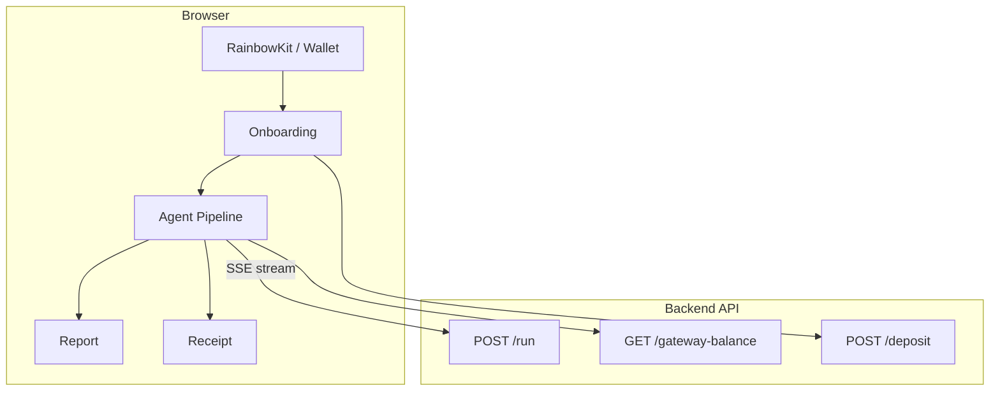

# AgentFlow Web — Next.js + RainbowKit

Next.js 14 app with RainbowKit wallet connection, Arc Testnet support, and SSE streaming from the AgentFlow backend.

### App flow



## Setup

1. Copy `.env.local.example` to `.env.local`:

   ```bash
   cp .env.local.example .env.local
   ```

2. Set `NEXT_PUBLIC_BACKEND_URL` to your backend (default: `http://localhost:4000`).

3. Optional: Add `NEXT_PUBLIC_WALLETCONNECT_PROJECT_ID` from [WalletConnect Cloud](https://cloud.walletconnect.com) for better wallet connection.

## Run locally

```bash
npm install
npm run dev
```

Open http://localhost:3005.

## Build for production

```bash
npm run build
npm start
```

## Vercel deployment

1. Deploy this folder (or the agentflow-frontend repo) as a Next.js project on Vercel.
2. Set environment variable: `NEXT_PUBLIC_BACKEND_URL` = your backend URL.
3. Optionally set `NEXT_PUBLIC_WALLETCONNECT_PROJECT_ID`.

## Backend requirements

The backend at `NEXT_PUBLIC_BACKEND_URL` must expose:

- `POST /run` — SSE stream of agent events (task in JSON body)
- `GET /gateway-balance` — returns `{ balance, formatted }` in USDC
- `POST /deposit` — body `{ amount: string }` — deposits to Gateway
